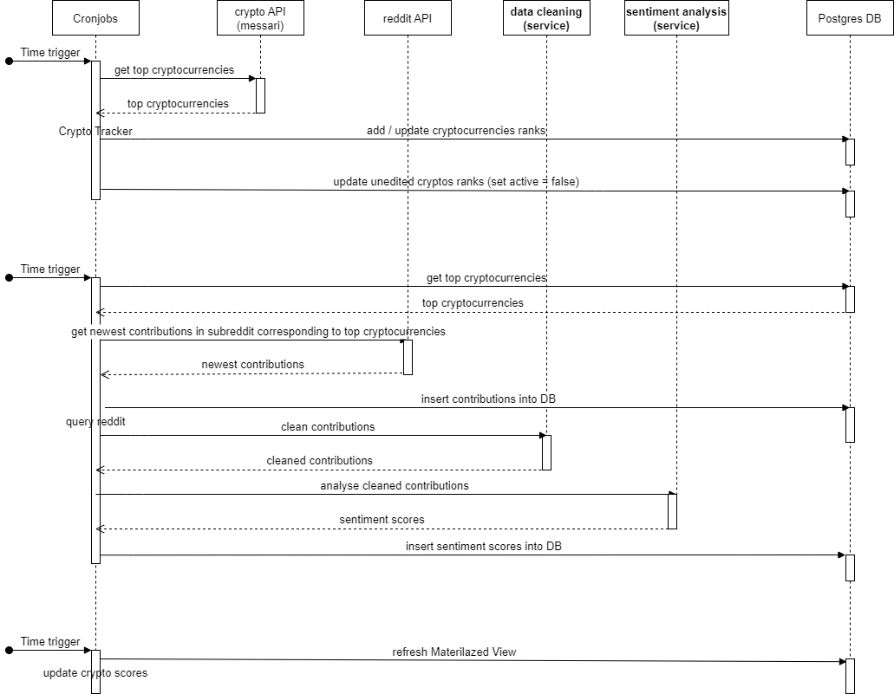

# crypto_rating_extra

This repository works as an additional repository to the main [repository](https://github.com/Pondo18/crypto-rating).
It provides necessary services, which should be executed through a cronjob running on Linux server.

* * *

## Services 
The repository contains multiple service, each holding a README.md on its own. 

## Sequence 

